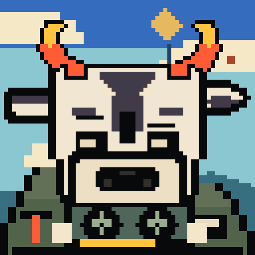
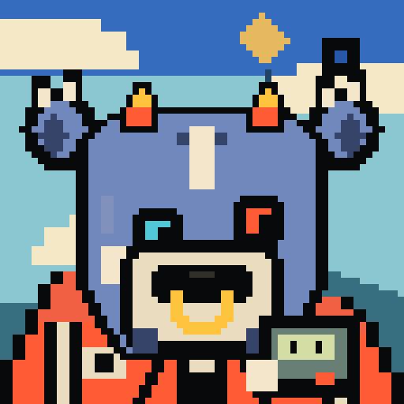
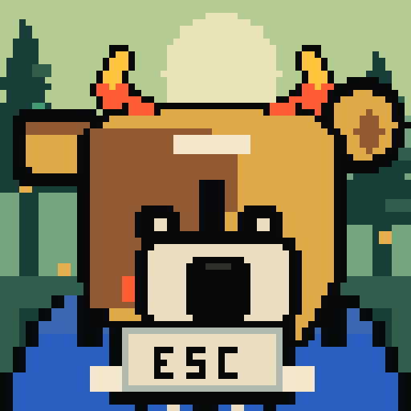

# BEARBULLS

Original pixel creatures caught between bear and bull. Awkward faces, unreasonable conviction, and small objects that explain far too much about their owners. A GPU brick. A founder pager. A paper CEO crown. An oversized escape key.

Meet four of them:

| #0029 · Nettle Softhoof | #0032 · Sludge Cloudhoof |
| :---: | :---: |
|  |  |
| CEO Of Nothing | Compute Is My Personality |
| **#0083 · Nettle Topbuyer** | **#0240 · Ticker Softhoof** |
|  |  |
| Founder Mode Pager | Exit Strategy |

## Market Mood Roll Call

**Which one are you today?**

[Find BEARBULLS on X](https://x.com/bearbullsclick) and share a specimen ID and your current mood. One line is enough: “#0240 — looking for the exit key.” You can be bullish, bearish, undecided, or simply here for the creature. No wallet or mint is needed to view these portraits or take part.

We’re inviting the first participants to make **Bear × Bull** cards by hand: two creatures, two people, two outlooks on the same day. Bring someone with a different take if you want. Each person approves the finished card before we publish it, and handles are included only with permission. Sharing is optional. Today’s caption does not change the creature’s original artwork.

There is no pairing app to download. This starts with a reply and a small creative exchange. Solo moods are welcome too.

## The creatures live onchain

The v0.25 prototype contains 100 curated creatures on **Robinhood testnet**. Each has a fixed identity and artwork, with metadata, a PNG portrait and animation stored onchain. Its first purchase used **100 mock USDG**, a test asset with no monetary value.

[Read the dated verification record](PROOF.md) for the contracts, provenance and mint receipt. A real-money launch has **not been announced**. BEARBULLS is an independent art project, with no Robinhood affiliation.

The planned home is `bearbull.click`; the domain and live site are not yet confirmed. For now, [@bearbullsclick](https://x.com/bearbullsclick) is where to say hello, choose a creature and bring your mood.
